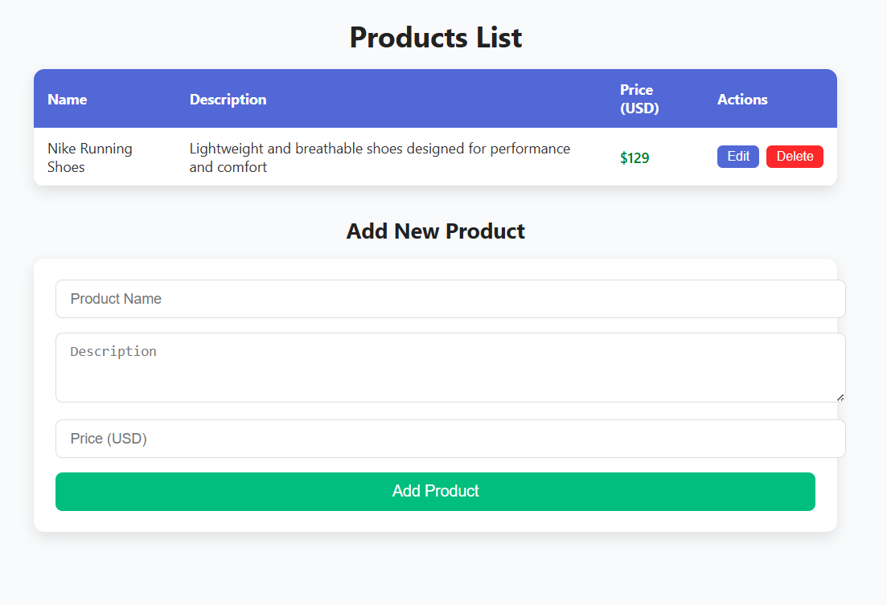
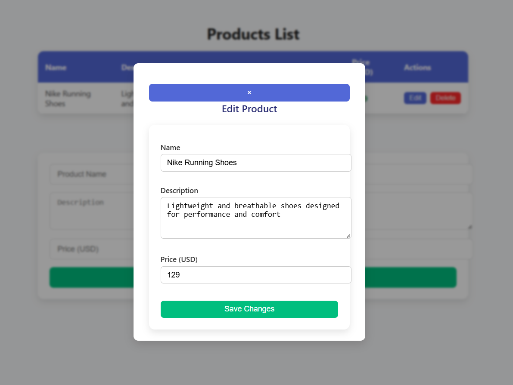
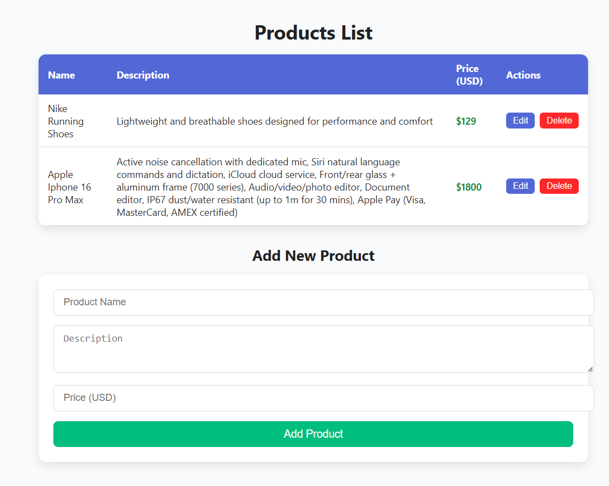

# Product CRUD API with Beautiful UI

A modern and elegant web application providing a full **CRUD (Create, Read, Update, Delete)** interface for managing products through a RESTful API and a sleek, user-friendly frontend UI.

---

## 🚀 Features

- **RESTful API** for product management
- Full **CRUD operations**: Create, Read, Update, Delete products
- Beautiful, responsive, and intuitive UI
- Real-time form validation and error handling

- Built with modern technologies

---

## 🛠️ Technologies Used

- **Backend:** Laravel
- **Database:** MySQL
- **Frontend:** Blade.php JS + CSS (replace as needed)
- **Styling:** CSS3, Flexbox/Grid, CSS / Bootstrap (replace accordingly)
- **API Testing:** Postman 

---

## Demo Screenshot
# HOME

# EDIT

# ADD NEW

# ADDED NEW IN DATABASE

